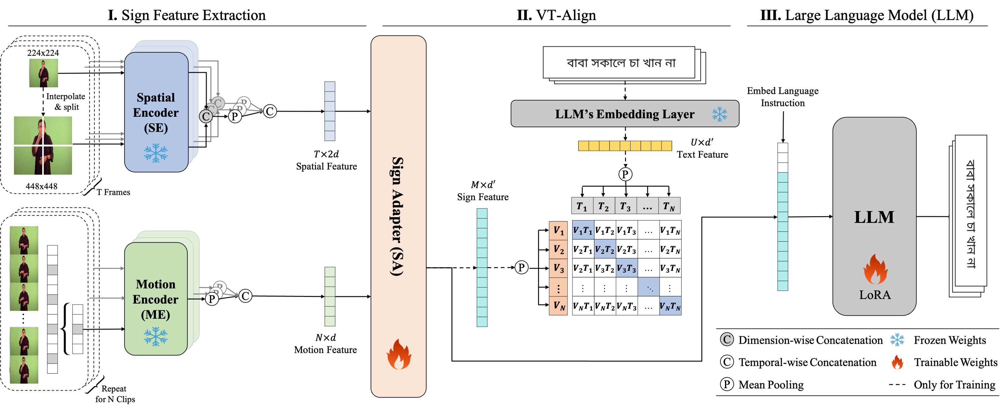

# SpaMo-BdSL: Gloss-Free Bangla Sign Language Translation

SpaMo-BdSL adapts the gloss-free **Spa**tial and **Mo**tion-based Sign Language Translation (**SpaMo**) framework ([NAACL 2025](https://aclanthology.org/2025.naacl-long.197.pdf)) to **Bangla Sign Language (BdSL)**. It translates sign language videos directly into Bangla text, without gloss annotations, using the [BanglaGov](https://huggingface.co/datasets/banglagov/Ban-Sign-Sent-9K-V1) dataset.


## Introduction



SpaMo fully exploits the spatial configurations and motion dynamics in sign videos using off-the-shelf, frozen visual encoders, without requiring domain-specific fine-tuning. The core idea is simple: we extract spatial features (spatial configurations) with a CLIP ViT and motion features (motion dynamics) with a VideoMAE, fuse them, and feed them into a language model with a language prompt to generate the target sentence.

SpaMo-BdSL keeps this architecture and runs the BanglaGov dataset through the pipeline. Two text backbones are provided:
- `csebuetnlp/banglat5` (247M params, Bangla-specific) — config `configs/finetune_banglagov.yaml`
- `bigscience/mt0-xl` (3.7B params, multilingual) — config `configs/finetune_banglagov_mt0.yaml`


## Environment

Install dependencies using:
```bash
pip install -r requirements.txt
```


## Dataset

We use the [BanglaGov](https://huggingface.co/datasets/banglagov/Ban-Sign-Sent-9K-V1) Bangla sign language sentence dataset (1,922 unique sentences, 5 signers each, 9,610 videos). The pipeline below assumes the dataset is stored under a common root (e.g. `Banglagov_Dataset/`) containing `Sign_Videos/` and `Bangla_Sign_Sentence_Mapping.csv`.

Replace the placeholders below with your own paths:
- `/PATH/TO/DATASET_ROOT` — root of the BanglaGov dataset (contains `Sign_Videos/` and the mapping CSV).
- `/PATH/TO/FRAME_ROOT` — where extracted frames are written/read.
- `/PATH/TO/SAVE_DIR` — where extracted ViT/VideoMAE features are saved.
- `/PATH/TO/CACHE_DIR` — Hugging Face model cache directory.


## Pipeline

The full BanglaGov pipeline runs in order. Adjust the paths to match your machine.

### 1. Extract frames from videos

```bash
python scripts/extract_frames_banglagov.py \
    --dataset_root /PATH/TO/DATASET_ROOT \
    --csv_path /PATH/TO/DATASET_ROOT/Bangla_Sign_Sentence_Mapping.csv \
    --output_dir /PATH/TO/FRAME_ROOT \
    --resize 256 256
```

### 2. Preprocess annotations (frames → npy)

```bash
python scripts/preprocess_banglagov.py \
    --csv_path /PATH/TO/DATASET_ROOT/Bangla_Sign_Sentence_Mapping.csv \
    --frame_root /PATH/TO/FRAME_ROOT \
    --output_dir ./preprocess/Banglagov
```

### 3. Extract spatial (ViT) features

```bash
python scripts/vit_extract_feature.py \
    --anno_root ./preprocess/Banglagov \
    --video_root /PATH/TO/FRAME_ROOT \
    --save_dir /PATH/TO/SAVE_DIR \
    --cache_dir /PATH/TO/CACHE_DIR \
    --device cuda:0 \
    --s2_mode s2wrapping --scales 1 2 \
    --batch_size 8
```

### 4. Extract motion (VideoMAE) features

```bash
python scripts/mae_extract_feature.py \
    --anno_root ./preprocess/Banglagov \
    --video_root /PATH/TO/FRAME_ROOT \
    --save_dir /PATH/TO/SAVE_DIR \
    --cache_dir /PATH/TO/CACHE_DIR \
    --device cuda:0 \
    --overlap_size 8 \
    --batch_size 8
```

### 5. Train

```bash
python main.py -c configs/finetune_banglagov.yaml -e bleu
```

Use `configs/finetune_banglagov_mt0.yaml` instead to train with the mT0-XL backbone.

### 6. Resume training from a checkpoint

```bash
python main.py -c configs/finetune_banglagov.yaml \
    -r logs/<RUN_LOG_DIR> \
    --ckpt last.ckpt -e bleu
```

### 7. Test

```bash
python main.py -c configs/finetune_banglagov.yaml -e bleu \
    --train False --test True \
    --ckpt logs/<RUN_LOG_DIR>/checkpoints/last.ckpt
```


## Notes

- The visual encoders (CLIP ViT-L/14 and VideoMAE-L/16) are **frozen**; features are extracted once (steps 3–4) and reused during training.
- The feature-extraction and training settings above are tuned to fit a single consumer-grade GPU (e.g. smaller batch sizes and frame caps). See `configs/finetune_banglagov.yaml` for the full configuration.


## Citation

This work builds on the original SpaMo framework. Please cite it if you find this repo helpful:

```bibtex
@inproceedings{hwang2025efficient,
  title={An Efficient Sign Language Translation Using Spatial Configuration and Motion Dynamics with LLMs},
  author={Hwang, Eui Jun and Cho, Sukmin and Lee, Junmyeong and Park, Jong C},
  booktitle={NAACL},
  year={2025}
}
```
